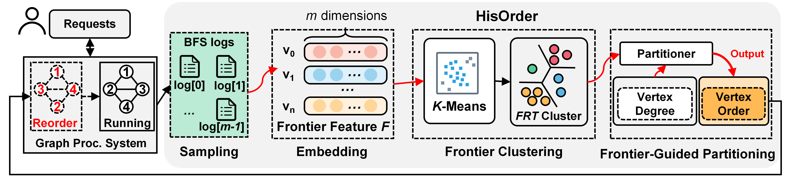

# Hisorder
Frontier-guided Distribution Graph Reordering

## What is it?
HisOrder is a graph reordering method, which improves graph locality to reduce the cache misses in graph processing. 

Unlike the previous reordering which depends on static characteristics in graph, HisOrder firstly profiles the traces of **His**torical graph processing (primarily the concurrent frontiers) to construct the locality metric between vertices, and then utilizes an unsupervised ML method (K-means at present) to excavate the clusters of high locality to guide graph **Reorder**ing. Furthermore, since the learned clusters of vertices are more likely to be co-activated, HisOrder also fine-tunes the load balance in parallel graph processing with the clusters. 



For more details, please refer to [our paper](https://liu-cheng.github.io/). 

## Getting Started
### 0. Dependencies

### 1. Compilation

### 2. Data Preparation

### 3. Graph Reordering
```shell
./hisorder -d /path/to/your/data -a 2 -s 1024 -o /path/to/store/data
```

    ./hisorder
    -d [ --data ] arg           input data path
    -o [ --output ] arg         output file path
    -s [ --size ] arg (=1024)   partition size(vertex number)
    -a [ --algorithm ] arg (=0) reordering algorithm
    -t [ --thread ] arg (=20)   threads
    -v [ --vertex ] arg (=100)  start vertex id(for new start vertex id)
    -f [ --feat ] arg (=10)     feature size, for hisorder algorithm
    -k [ --kv ] arg             k value for kmeans
    -i [ --input_feat ] arg     input feature file
    -r [ --output_map]  arg     output mapping file

    [ --algorithm ]
    original = 0,
    hisorder_wo_blc = 1,
    hisorder = 2,

## Evaluation
### Compilation
### Running Graph Algorithms

## Benchmark Summary

## Future Work

## Citation

## References